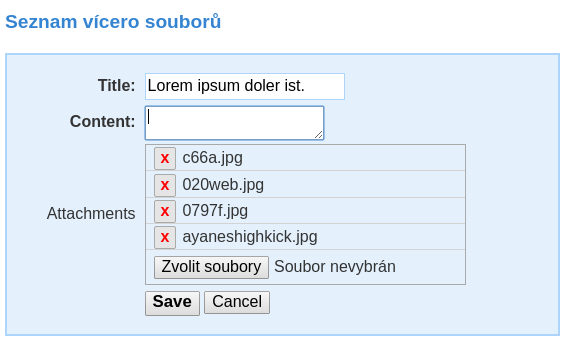
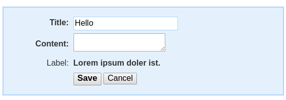
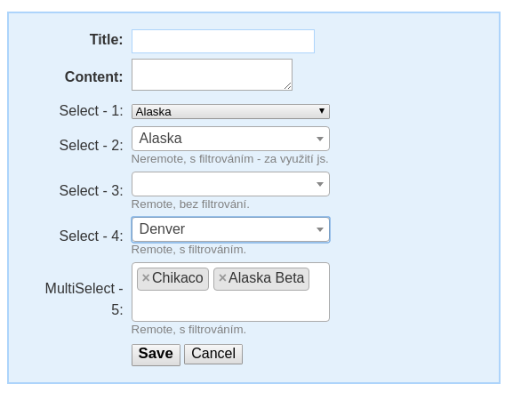

nette-form-controls
===================

[](https://travis-ci.org/tacoberu/nette-form-controls)

Ext form controls for Nette: DateInput, TimeInput, ColorInput, MultipleUploadControl, LabelField, SelectBoxRemoteControl and latte macros. With example javascript support.


## Installation
```
composer require tacoberu/nette-form-controls
```


## Usage

### DateInput

```php
$form = new Nette\Forms\Form;

$form['date'] = new DateInputSingle('Date:', 'j. n. Y');
$form['date']->setStart(new Data\DateTime('2011-01-01'));
$form['date']->setEnd(new Data\DateTime('2011-01-11'));
$form['date']->setDefaultValue(new Data\DateTime('2003-12-02'));

```


### TimeInput

```php
$form = new Nette\Forms\Form;

$form['time'] = new TimeInputSingle('Time:');
$form['time']->setDefaultValue(new Data\Time('20:12:02'));

```


### ColorInput

```php
$form = new Nette\Forms\Form;

$form['color'] = new ColorInput('Color:');
$form['color']->setDefaultValue('#ababab');

```


### MultipleUploadControl

```php
$form = new Nette\Forms\Form;

$form['attachments'] = new MultipleUploadControl('Color:');
$form['attachments']->setDefaultValue([
	new Http\FileUploaded("uploaded/account/56695/mp16.jpg", "image/jpeg"),
]);

```



### LabelField

```php
$form = new Nette\Forms\Form;

$form['label'] = new LabelField('Label:');
$form['label']->setDefaultValue('Lorem ipsum doler ist.');

```




### SelectBoxRemoteControl

```php
$form = new Nette\Forms\Form;

// CallbackQueryModel is buildin implementation of generic QueryModel.
$categorySelectQueryModel = new CallbackQueryModel(function($term, $page, $pageSize) use ($data) {
	$results = [];
	foreach ($data as $x) {
		if ($term && stripos($x->label, $term) === False) {
			continue;
		}
		$results[] = (object) [
			'id' => $x->id,
			'label' => $x->label,
		];
	}
	$total = count($results);
	$offset = ($page - 1) * $pageSize;
	return (object) [
		'total' => $total,
		'items' => array_slice($results, $offset, $pageSize),
	];
}, function($id) use ($data) {
	foreach ($data as $x) {
		if ($x->id === $id) {
			return $x;
		}
	}
});

$form['category'] = new SelectBoxRemoteControl($categorySelectQueryModel, 'Category:');
$form['tags'] = new MultiSelectBoxRemoteControl($this->getTagSelectQueryModel(), 'Tags:');

```




